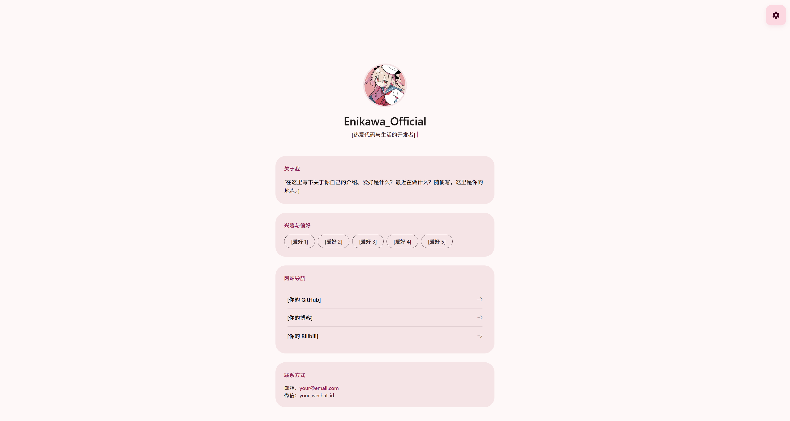

# M3E_html_HOME


一个基于纯原生 HTML / CSS / JavaScript 构建的类 Android 12+ **M3E (Material 3 Expressive)** 风格个人主页。无需构建工具，配置与逻辑完全分离，非常适合作为开发者的个人名片或卡片式主页。

- **在线演示**：[enik.de5.net](https://enik.de5.net/)
- **作者 GitHub**：[@Sdbdzh](https://github.com/Sdbdzh)
- **项目仓库**：[Sdbdzh/M3E_html_HOME](https://github.com/Sdbdzh/M3E_html_HOME)

---

## 📸 预览截图

> 请将你的页面截图命名为 `preview.png` 并放在项目根目录，然后在此处替换下方的链接。



*(建议上传一张浅色模式、一张深色模式的截图)*

---

## ✨ 核心特性

### 🎨 视觉与动效 (M3E 规范)

- **底部充能波纹**：页面加载时，底部粉色光晕向上蔓延，卡片随之从下到上逐级浮现。
- **卡片充能亮起**：波纹扫过卡片时，卡片瞬间提亮并带有粉色外发光，随后内部文字交错浮现。
- **头像点击传导**：点击头像会从中心向四周扩散波纹，波纹扫过哪个卡片或设置按钮，哪个就瞬间亮起。
- **Q弹模糊浮现**：头像拥有强烈的果冻回弹效果，配合从模糊到清晰的过渡。
- **打字机循环**：名字打完后光标延迟消失；签名支持多文本无限循环打字、等待、删除。
- **精准水波纹**：区分卡片背景与内部元素（点卡片空白触发卡片波纹，点标签/列表触发自身波纹）。

### ⚙️ 功能与体验

- **配置分离**：所有文本、链接、图片路径、动画时长、背景设置全部收敛在独立的 `config.js` 文件中，改内容不用翻代码。
- **自定义背景图片**：支持多张壁纸自动轮播、模糊度、透明度、对齐方式（放大 / 裁剪 / 自适应 / 拉伸）自定义。
- **六种卡片类型**：文本、标签、技术栈徽章、链接列表、联系方式、富文本链接，按需组合。
- **全局防误触**：默认禁用文本高亮，防止连续点击时出现蓝色选中块；联系方式卡片保留可复制白名单。
- **主题切换**：支持浅色（Light）、深色（Dark）、跟随系统（System）三种模式，并自动写入 `localStorage` 持久化保存。
- **响应式设计**：完美适配 PC、平板和手机端布局，移动端设置面板自动变为底部弹窗。
- **零依赖**：无需 Node.js、无需 npm，双击 `index.html` 即可运行。

---

## 🚀 快速开始

### 1. 克隆项目

```bash
git clone https://github.com/Sdbdzh/M3E_html_HOME.git
cd M3E_html_HOME
```

### 2. 准备素材

在项目根目录准备以下文件（或修改 `config.js` 中的路径指向你的文件）：

- 头像：命名为 `tx.jpg`（支持 `jpg` / `png` / `webp`）。
- 网站图标：命名为 `favicon.ico`（支持 `ico` / `png` / `svg`）。

### 3. 本地预览

直接双击打开 `index.html` 即可在浏览器中查看效果。

---

## 📁 项目结构

```text
M3E_html_HOME/
├── index.html          # 主文件（页面结构 + 样式 + 逻辑）
├── config.js           # ★ 网站配置文件（你只需要改这个）
├── tx.jpg              # 你的头像（需自行添加）
├── favicon.ico         # 网站图标（需自行添加）
├── preview.png         # 预览图（建议添加，用于 README）
├── LICENSE             # MIT 开源协议
└── README.md           # 项目说明文档
```

---

## ⚙️ 详细配置指南

打开项目根目录下的 `config.js` 文件。所有可修改的内容都集中在这里，修改后保存并刷新网页即可生效。

### 网站全局配置

```javascript
site: {
    name: "Enikawa_Official", // 浏览器标签页显示的网站名字
    favicon: "./favicon.ico"   // 网站图标路径
}
```

### 背景图片配置

```javascript
background: {
    enable: true,          // 是否启用背景图（true 开启，false 关闭）
    images: [              // 壁纸列表（支持多张自动轮播，按顺序播放）
        "url1",
        "url2"
    ],
    interval: 5,           // 壁纸循环切换间隔（秒，建议 >= 3 秒）
    blur: 5,               // 模糊度（px，0 为不模糊，推荐 3~10）
    opacity: 0.15,         // 透明度（0.0 ~ 1.0，推荐 0.1~0.3，避免影响卡片阅读）
    fit: "cover"           // 对齐方式：cover(放大) / contain(裁剪) / auto(自适应) / fill(拉伸)
}
```

### 个人资料配置

```javascript
profile: {
    name: "Enikawa_Official", // 主页显示的名字
    nameTypeSpeed: 100,        // 名字打字速度（毫秒/字，100 代表每秒 10 个字）
    nameCursorDelay: 1000,     // 名字打完后，光标停留多久消失（毫秒）
    avatarSrc: "./tx.jpg",     // 头像路径
    signaturePause: 2,         // 签名打完后，停留几秒开始删除（秒）
    signatureTypeSpeed: 60,    // 签名打字速度（毫秒/字，越小越快）
    signatureDeleteSpeed: 30,  // 签名删除速度（毫秒/字，越小越快）
    signatures: [              // 签名列表（支持多条签名无限循环播放）
        "热爱代码与生活的开发者",
        "你的签名 / 职业 / 个人格言"
    ]
}
```

### 卡片配置（支持六种类型）

```javascript
cards: [
    // ── 类型 1：纯文本卡片（支持 HTML 标签，可嵌入链接） ──
    {
        title: "关于我",
        type: "text",
        content: "我是 Enikawa，欢迎访问我的 <a href='https://github.com/Sdbdzh' target='_blank'>GitHub</a>。"
    },
    // ── 类型 2：标签药丸卡片 ──
    {
        title: "兴趣与偏好",
        type: "chips",
        content: ["爱好 1", "爱好 2", "爱好 3"]
    },
    // ── 类型 3：技术栈徽章卡片（支持点击跳转） ──
    {
        title: "技术栈",
        type: "badges",
        content: [
            {
                name: "HTML5",
                img: "https://img.shields.io/badge/HTML5-E34F26?style=flat-square&logo=html5&logoColor=white",
                url: "https://developer.mozilla.org/zh-CN/docs/Web/HTML" // url 可选
            },
            {
                name: "GitHub",
                img: "https://img.shields.io/badge/GitHub-Sdbdzh-181717?style=flat-square&logo=github&logoColor=white",
                url: "https://github.com/Sdbdzh"
            }
        ]
    },
    // ── 类型 4：链接列表卡片 ──
    {
        title: "网站导航",
        type: "list",
        content: [
            { name: "GitHub", url: "https://github.com/Sdbdzh" },
            { name: "我的博客", url: "https://example.com" }
        ]
    },
    // ── 类型 5：联系方式卡片（列表形式，可选中复制） ──
    {
        title: "联系方式",
        type: "contact",
        content: [
            { name: "邮箱", value: "your@email.com", link: "mailto:your@email.com" }, // link 可选
            { name: "微信", value: "your_wechat_id" },
            { name: "QQ", value: "123456789" }
        ]
    },
    // ── 类型 6：版权声明卡片（也是文本，用于页脚） ──
    {
        title: "版权声明",
        type: "text",
        content: "© 2026 Enik / Эник. All Rights Reserved."
    }
]
```

---

## 🎨 卡片类型速查表

| type | 说明 | content 格式 |
| --- | --- | --- |
| `text` | 纯文本（支持 HTML 标签与超链接） | 字符串 |
| `chips` | 标签药丸 | 字符串数组 |
| `badges` | 技术栈徽章（shields.io） | 对象数组 `{ name, img, url? }` |
| `list` | 链接列表 | 对象数组 `{ name, url }` |
| `contact` | 联系方式（可选中复制） | 对象数组 `{ name, value, link? }` |

---

## 🏷️ Shields.io 徽章速查

技术栈徽章使用 Shields.io 生成，URL 格式：

```text
https://img.shields.io/badge/{标签}-{内容}-{颜色}?参数
```

常用参数：

| 参数 | 作用 | 示例 |
| --- | --- | --- |
| `style` | 样式 | `flat-square` / `flat` / `plastic` / `for-the-badge` |
| `logo` | 左侧图标 | `html5` / `css3` / `github` / `python` |
| `logoColor` | 图标颜色 | `white` / `black` / `FF0000` |
| `labelColor` | 左侧背景色 | `555` / `blue` |

示例：

```text
https://img.shields.io/badge/Rust-000000?style=flat-square&logo=rust&logoColor=white
https://img.shields.io/badge/Python-3776AB?style=flat-square&logo=python&logoColor=white
```

---

## 📦 部署到 GitHub Pages

本项目是纯静态网站，非常适合通过 GitHub Pages 免费托管。

1. 将代码推送至你的 GitHub 仓库 `Sdbdzh/M3E_html_HOME`。
2. 进入仓库的 **Settings（设置）** 页面。
3. 在左侧边栏找到 **Pages**。
4. 在 **Build and deployment** 下，将 **Source** 选择为 **Deploy from a branch**。
5. **Branch** 选择 `main`（或 `master`），目录选择 `/ (root)`，然后点击 **Save**。
6. 等待约 1-2 分钟，刷新页面即可在顶部看到部署成功的网址：

```text
https://sdbdzh.github.io/M3E_html_HOME/
```

### 绑定自定义域名（可选）

1. 在仓库根目录创建名为 `CNAME` 的文件（无后缀），内容填写你的域名（如 `enik.de5.net`）。
2. 在域名服务商添加 DNS 记录：
   - A 记录指向 `185.199.108.153`
   - 或 CNAME 记录指向 `sdbdzh.github.io`
3. 在仓库 **Settings → Pages → Custom domain** 中输入域名，点击 **Save**。
4. 勾选 **Enforce HTTPS** 以启用 SSL 加密。

---

## ❓ 常见问题 (FAQ)

### Q：为什么网页白屏，或者在控制台报错 未找到 SITE_CONFIG？

A：请确认项目根目录下存在 `config.js` 文件，并且 `index.html` 中的 `<script src="./config.js"></script>` 没有拼写错误。`config.js` 必须在主逻辑脚本之前加载。

### Q：为什么我的头像不显示？

A：请检查头像文件名是否为 `tx.jpg`，并确保它与 `index.html` 处于同一目录下。或者在 `config.js` 的 `avatarSrc` 中修改为正确的相对路径。

### Q：为什么每次打开网页都会重新播放充能动画？

A：这是 M3E 原生风格的启动流程，刻意设计为每次刷新都播放一次，以增强系统的“开机”仪式感。

### Q：背景图片轮播有闪烁怎么办？

A：本项目使用了双图层交叉淡入淡出技术，正常不会闪烁。如果出现闪烁，请检查 `background.interval` 是否设置过短（建议不小于 3 秒），以及图片文件是否过大（建议压缩后使用）。

### Q：怎么修改充能波纹的颜色？

A：在 `index.html` 的 `<style>` 顶部的 `:root[data-theme="light"]` 和 `:root[data-theme="dark"]` 变量中，修改 `--wave-color` 和 `--card-charge-brightness` 的值即可。

### Q：本地双击 `index.html` 打不开怎么办？

A：请确认你的浏览器版本较新（推荐 Chrome / Edge / Firefox 最新版）。本项目使用了 `cubic-bezier` 和 `backdrop-filter` 等现代 CSS 特性，老旧浏览器（如 IE）无法支持。

---

## 🛠️ 技术栈

- **HTML5**：语义化标签与结构
- **CSS3**：CSS 变量、Flexbox、Grid、动画、过渡、滤镜
- **原生 JavaScript (ES6+)**：无任何框架，纯 DOM 操作
- **Material 3 Expressive**：遵循 Android 12+ 官方设计规范
- **Shields.io**：动态技术栈徽章服务

---

## 🤝 贡献指南

欢迎提交 Issue 或 Pull Request！

1. Fork 本项目
2. 创建你的分支 (`git checkout -b feature/AmazingFeature`)
3. 提交改动 (`git commit -m 'Add some AmazingFeature'`)
4. 推送到分支 (`git push origin feature/AmazingFeature`)
5. 开启一个 Pull Request

---

## 📄 开源协议

本项目采用 **MIT License** 协议进行开源。  
你可以自由地使用、修改、分发本项目，甚至可以用于商业用途。唯一的条件是在副本或实质性部分中保留原作者的版权声明。

Copyright (c) 2026 Sdbdzh

---

## 💡 灵感来源

- UI 风格规范来源于 Android 12+ 的 Material You 动态取色系统与 Material 3 Expressive 动效规范。
- 徽章服务由 [Shields.io](https://shields.io/) 提供。
- 感谢所有在开发过程中提供宝贵建议的人。
